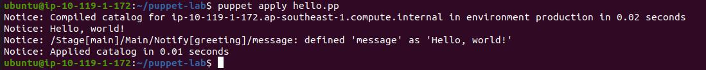

# DAY 1 

## In this lab, we will install and configure Puppet on the system.
- Install puppet5 on the system and verify the version.
- Create a notify task which will print ""Hello I am learning Puppet""."

## Lab part-2
- Create a file hello.pp
- Paste below code
	notify { 'greeting':
	    message => 'Hello, world!',
	}
- Run using command
	puppet apply hello.pp
- 

