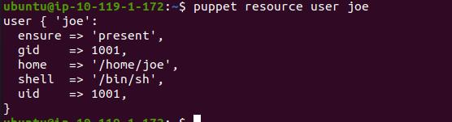
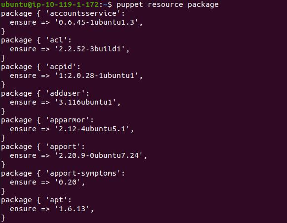
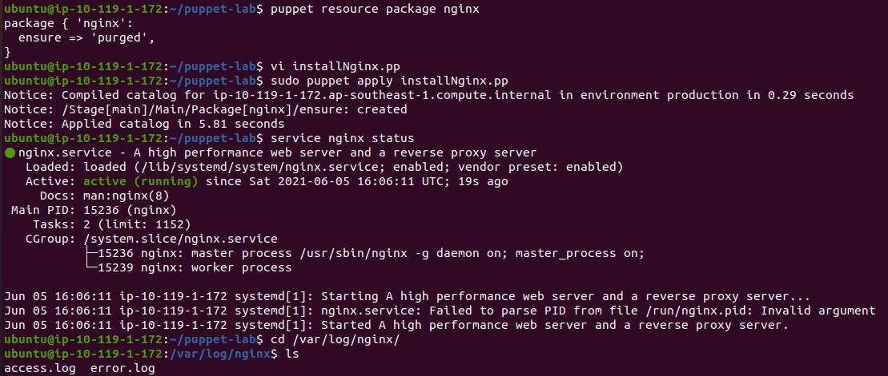
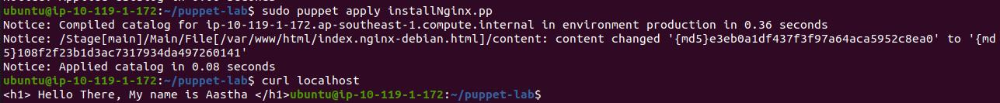
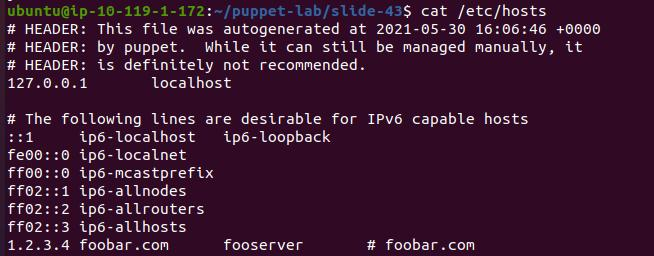
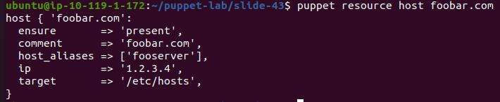

# DAY1 Lab3

## In this lab, we will learn how we can use Puppet resources.
- Execute puppet resources command to get information of "joe" user created by you.
- Execute puppet resources command to get all packages information and observe the output.
- Create a package resource to install nginx and vim on the system.
- Use file resources and update the Nginx HTML page with the content.
    "Hello There, My name is <name>"
- Use the service resource to reload the service and see if your nginx page is updated.
- Create a /etc/host entry for your system IP and <name>.puppetlearn.com and make sure you don't overwrite the content.
- Install puppet-lint on the system and execute it against the resources.

Bonus Lab:- Create a resource to stop the nginx service and remove the package from the system.

## Instructions to perform this lab
### Execute puppet resources command to get information of "joe" user created by you.
```
	puppet resource user joe
```
-

### Execute puppet resources command to get all packages information and observe the output.
```
	puppet resource package
```
-

### Create a package resource to install nginx and vim on the system.
- Add script to install nginx package
```
	package { 'nginx':
	    ensure => present
	}
```
- Declare the nginx service. Service resources manage daemons, or background processes, on the server. The ensure attribute tells Puppet what state the service should in 
```
	service { 'nginx':
	    ensure => running,
	    require => Package['nginx'],
	}

```
- 
### Use file resources and update the Nginx HTML page with the content.
    "Hello There, My name is <name>"
```
	file { '/var/www/html/index.nginx-debian.html':
	  ensure  => present,
	  replace => true,
	  content => '<h1> Hello There, My name is Aastha </h1>',
	}
```
- 
- 

### Create a /etc/host entry for your system IP and foobar.com and make sure you don't overwrite the content.
- Create  puppet filei host.pp. Add below code.
```
	host { 'foo':
	  name         => 'foobar.com', 
	  ensure       => 'present',
	  comment      => 'foobar.com', 
	  host_aliases => 'fooserver',
	  ip           => '1.2.3.4',
	  target       => '/etc/hosts',  
	}
```
- 
- 


