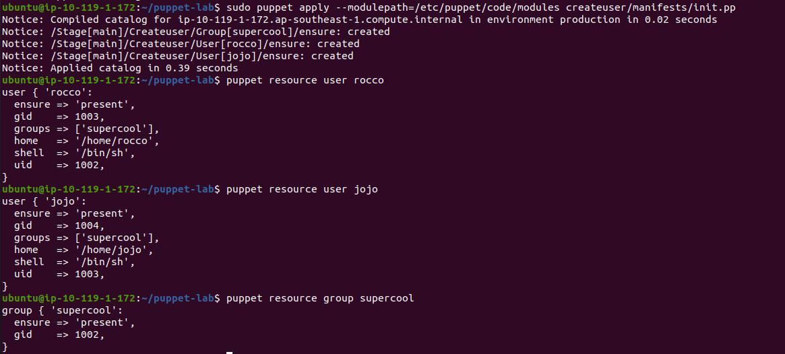

# DAY1 Lab5

## In this lab, we are going to learn the concept of Puppet Modules.
- Create a directory structure for the module with your name.
- Try to print the module-path using the puppet command.
- Create a manifest to create 2 users and 1 one group. Make sure both users should belong to the same group
- Verify the changes on the system, if the users are created or not.

Bonus Lab:- Create a module for nginx installation just like you have created for user creation."

## Instructions to perform this lab
### Create a directory structure for the module with your name.
```
	puppet module generate author-modulename
```
### Try to print the module-path using the puppet command.
```
	puppet config print modulepath
```
### Create a manifest to create 2 users and 1 one group. Make sure both users should belong to the same group
- Make changes to manifests/init.pp
```
	class createuser {
	group { 'supercool':
        	ensure => 'present',
	}

	user { 'rocco' :
		ensure => present,
		groups     => ['supercool'],
		managehome => 'true',
	}	

	user { 'jojo' :
        	ensure => present,
		groups     => ['supercool'],
	}
	}

	class { 'createuser': }
```


### Verify the changes on the system, if the users are created or not.
- - 

