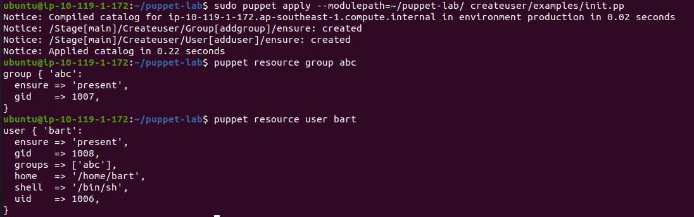

# DAY2 Lab1

## In this lab, we are going to learn the concepts about Variables, Facter, and Templates.
- Extend the module created by you guys and define a user name and group name as variables.
- Apply the puppet to see if there is any change or not. Try to change the value of the variable and apply it again.
- Create a module for Nginx installation and configuration.
- Create a template for the index.html page of Nginx and substitute your name as a variable in it.
- Use facters for OS family and add the fact-value in the HTML page.

Bonus Lab:- Add IP and domain name entry in /etc/hosts using factors. Also, try to create a template for nginx.conf.

### Extend the module created by you guys and define a user name and group name as variables.
- move to yourmodule/manifests/init.pp and add parameters to class
```
	class createuser ($groupname, $username)
	{
	group { addgroup:
        	name => $groupname,
        	ensure => 'present',
	}

	user {  adduser:
        	name => $username,
        	ensure => present,
        	groups     => $groupname,
        	managehome => 'false',
	}

	}
```
- move to yourmodule/examples/init.pp and call the class
```
	class { createuser:
	    groupname => "abc",
	    username => "bart",
  	}
```
### Apply the puppet to see if there is any change or not. Try to change the value of the variable and apply it again.
```
	sudo puppet apply --modulepath=~/puppet-lab/ createuser/examples/init.pp 
```
- Cross check creation of group and user
- 
- Add more user and group by changing variable values

### Create a module for Nginx installation and configuration.
- We have already worked around Nginx using puppet. Try following tasks on your own.


